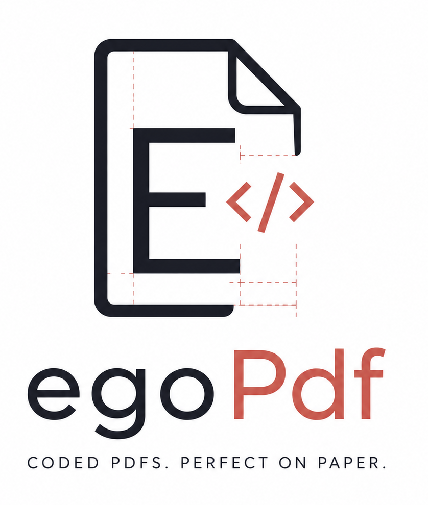

<p align="center">
  
</p>

# EgoPDF

PDF generator for .NET, originally an automated port of
[FPDF](http://www.fpdf.org) from PHP with hand-tuned fixes on top.
Three NuGet packages live in this repo:

| Package | Purpose | Status |
| --- | --- | --- |
| [`EgoPDF.Generator`](https://www.nuget.org/packages/EgoPDF.Generator) | Core FPDF API, SkiaSharp font embedding, layout primitives (`Row` / `Stack` / `Panel` / `PanelStyle`) and scope helpers (`PushState` / `PushPos`) | Stable |
| [`EgoPDF.Barcodes`](https://www.nuget.org/packages/EgoPDF.Barcodes) | Every 1D and 2D barcode symbology (Code 128, EAN, UPC, QR, Data Matrix, PDF417, Aztec, ...) plus Zebra ZPL II label emulation | Preview |
| [`EgoPDF.Markdown`](https://www.nuget.org/packages/EgoPDF.Markdown) | CommonMark + GFM → PDF, built on Markdig + EgoPDF.Generator, with a built-in shortcode extension (`[[name k=v ...]]`) | Preview |

All three packages target `net8.0` and `net9.0` and ship under the MIT
license. `EgoPDF.Generator` additionally carries a `NOTICE` file
acknowledging FPDF, the PHP project it was originally automated from.
`EgoPDF.Barcodes` and `EgoPDF.Markdown` are original work and pin
`EgoPDF.Generator` to an exact version per preview.

## What's here

```
Ego.PdfCore/          → EgoPDF.Generator package source
Ego.PDF.Barcodes/     → EgoPDF.Barcodes package source
Ego.PDF.Markdown/     → EgoPDF.Markdown package source
Ego.PDF.Samples/      → reusable sample code consumed by the test harness and WebDemo
Ego.Pdf.Test/         → xUnit tests; the DoSample*/DoZebra* facts emit PDFs next to the test binary, the Baseline_* facts SHA-256-compare against canonical baselines under Ego.Pdf.Test/Baselines
WebDemo/              → ASP.NET Core demo site that exposes the same samples over HTTP
RECIPES.md            → agent-facing catalogue of reusable patterns and primitives
```

## Quick start

### Plain PDF

```csharp
using Ego.PDF;
using Ego.PDF.Data;

using var pdf = new FPdf("hello.pdf");
pdf.AddPage(PageSizeEnum.A4);
pdf.SetFont("Helvetica", "B", 24);
pdf.Cell(0, 10, "Hello from EgoPDF!");
pdf.Close();
```

### Layout primitives

```csharp
using Ego.PDF;
using Ego.PDF.Data;

using var pdf = new FPdf("report.pdf");
pdf.AddPage(PageSizeEnum.A4);

var slots = pdf.Row(pdf.Bounds(), new[] { 2.0, 1.0 }, gap: 3);
var brandPanel = new PanelStyle { FillColor = ..., BorderColor = ..., TitleColor = ... };

pdf.Panel(slots[0], "DETAILS", brandPanel, content =>
{
    // 'content' is the inner rect, font / colour / line-width state
    // is restored automatically when the lambda returns.
    pdf.SetXY(content.X, content.Y);
    pdf.Cell(content.W, 5, "Auto-restored state, no leakage.");
});
```

See [`RECIPES.md`](RECIPES.md) for the full catalogue.

### ZPL → PDF

```csharp
using Ego.PDF;
using Ego.PDF.Data;
using Ego.PDF.Barcodes.Zpl;

using var pdf = new FPdf("label.pdf");
pdf.SetUnitConverionFactor(UnitEnum.Point, 203);
pdf.LoadFont("robotomonob", "RobotoMono-Bold.ttf");
pdf.AddFont("robotomonob", "");
pdf.SetFont("helvetica", "B", 16);

var zpl = new PdfZpl(pdf, dpi: 203);
zpl.SetLabelSize(812, 1218);            // 4" x 6" at 203 dpi
zpl.SetVariableFont("helvetica", "B");
zpl.SetMonospaceFont("robotomonob");

zpl.Print(@"
^XA
^FO50,50^FDHello from EgoPDF.Barcodes!^FS
^FO50,200^BCN,80,N,N,N^FD12345678^FS
^XZ
");

pdf.Close();
```

### Markdown → PDF

```csharp
using Ego.PDF;
using Ego.PDF.Data;
using Ego.PDF.Markdown;

using var pdf = new FPdf("readme.pdf");
pdf.AddPage(PageSizeEnum.A4);

var theme = MarkdownTheme.Default;
// theme.Shortcodes.Register("barcode", new BarcodeShortcode());
// theme.Shortcodes.Register("cta",     new CallToActionShortcode());

MarkdownRenderer.Render(pdf, @"
# Hello from EgoPDF.Markdown

**CommonMark** + *GFM* on top of the core engine. Headings, lists, code
blocks, links, autolinks, images, block quotes — and a tiny shortcode
extension for anything Markdown doesn't cover natively:

[[pagebreak]]

Mixed-mode documents (imperative drawing + Markdown in the same FPdf
instance) are the recommended pattern for branded headers + Markdown
bodies.
", theme);

pdf.Close();
```

Per-package READMEs (with the full list of supported ZPL commands, the
Markdown shortcode reference and a longer feature list for the
generator) live next to each project.

## Building locally

```bash
dotnet build PDF.sln
dotnet test Ego.Pdf.Test/Ego.Pdf.Test.csproj
dotnet pack Ego.PdfCore/Ego.PdfCore.csproj         -c Release -o artifacts
dotnet pack Ego.PDF.Barcodes/Ego.PDF.Barcodes.csproj -c Release -o artifacts
dotnet pack Ego.PDF.Markdown/Ego.PDF.Markdown.csproj -c Release -o artifacts
```

The test project mixes two kinds of facts:

- `DoSample*` / `DoZebra*` smoke tests drop their PDF output beside the
  test binary so a human can eyeball the result against a reference
  render (Labelary for ZPL, Adobe / PDF.js for the generator samples).
- `Baseline_*` visual baseline tests SHA-256-hash the canonical PDF
  bytes (xref + `/CreationDate` normalised) and compare against
  `Ego.Pdf.Test/Baselines/{name}.sha256`. Set the environment variable
  `EGOPDF_UPDATE_BASELINES=1` to accept the current output as the new
  baseline.

## License

[MIT](LICENSE). See [NOTICE](NOTICE) for the FPDF acknowledgment that
ships with `EgoPDF.Generator`. `EgoPDF.Barcodes` and `EgoPDF.Markdown`
are original work and contain no FPDF-derived code. "Zebra" and "ZPL"
are trademarks of Zebra Technologies; this project is not affiliated
with or endorsed by them.

Third-party runtime dependencies, all distribution-compatible with MIT:

| Package | Version | License | Used by |
| --- | --- | --- | --- |
| [SkiaSharp](https://github.com/mono/SkiaSharp) | 3.116.1 | MIT | `EgoPDF.Generator` |
| [ZXing.Net](https://github.com/micjahn/ZXing.Net) | 0.16.10 | Apache 2.0 | `EgoPDF.Barcodes` |
| [Markdig](https://github.com/xoofx/markdig) | 0.40.0 | BSD-2-Clause | `EgoPDF.Markdown` |
